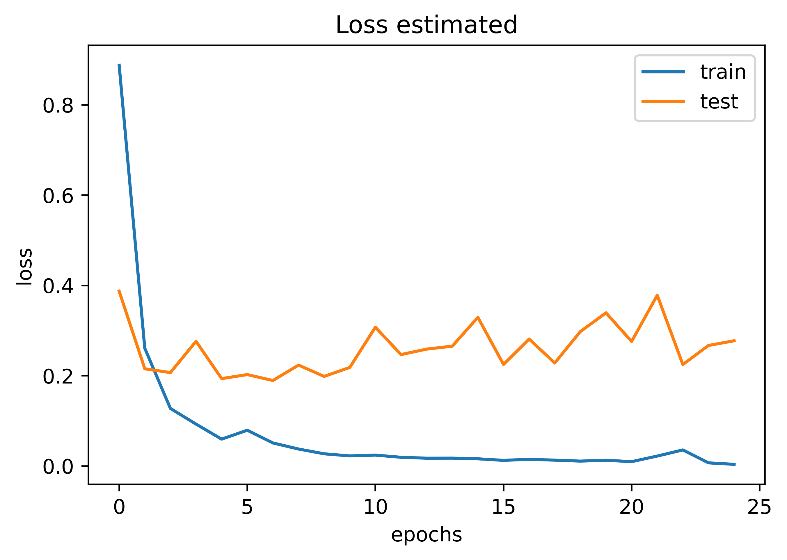
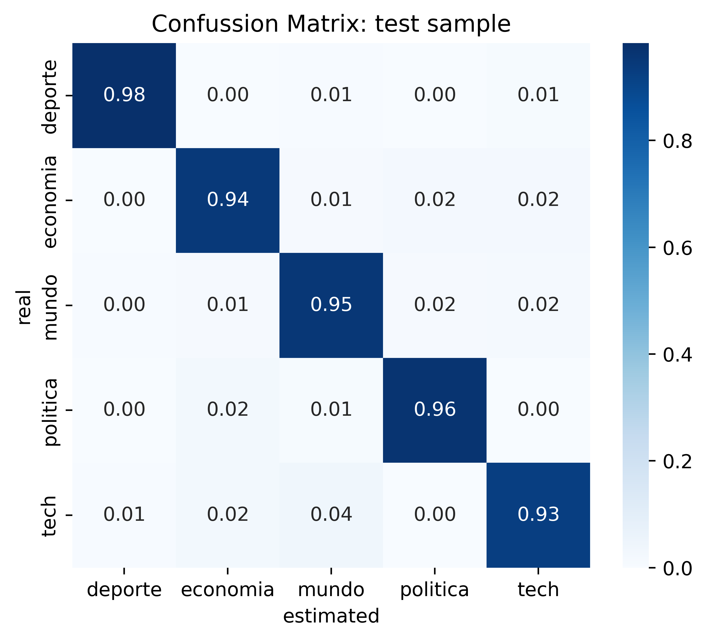

# Clasificación de noticias de El Comercio
El Comercio el más periódico más antiguo e importante del Perú. Las principales categorías de las noticias son las siguientes:
- Política
- Mundo
- Economía
- Deportes
- Tecnología

El **objetivo** de este proyecto es elaborar una red neuronal recurrente (RNN) capaz de clasificar las categorías basado en el contenido.


## Pasos
El proceso se divide en los siguientes pasos:
1. [Extraer el contenido de cada una de la noticias](https://github.com/mauricioalvaradoo/classification_news/blob/master/1_scraping.py), mediante web scraping.
2. [Crear un corpus](https://github.com/mauricioalvaradoo/classification_news/blob/master/2_corpus.py), en el que se categoriza todas las noticias según temática.
3. [Crea una red neuronal recurrente](https://github.com/mauricioalvaradoo/classification_news/blob/master/3_classification.py), que interprete el contexto de las noticias.

Cada noticia fue almacenada en las siguientes rutas:
- [news/politica](https://github.com/mauricioalvaradoo/classification_news/blob/master/news/politica)
- [news/mundo](https://github.com/mauricioalvaradoo/classification_news/blob/master/news/mundo)
- [news/economia](https://github.com/mauricioalvaradoo/classification_news/blob/master/news/economia)
- [news/deporte](https://github.com/mauricioalvaradoo/classification_news/blob/master/news/deporte)
- [news/tech](https://github.com/mauricioalvaradoo/classification_news/blob/master/news/tech)

Las fechas consideradas en la extracción son de **01/01/2023** a **26/09/2023**. Son **29'837** noticias.


## Configuración de la GPU
Dada la gran cantidad de noticias, es necesario configurar [tensorflow](https://www.tensorflow.org/?hl=es-419) para que permita estimaciones de redes neuronales con la GPU, lo cual acelerará en gran medida los tiempos por época (_epoch_). De manera ilustrativa, cada _epoch_ pudo haber demorado cerca a 4 horas en ser estimada por la CPU, pero únicamente tomó 12 minutos con la GPU. En total, fue necesario 25 _epochs_.

Pasos:
1. Windows 7 o superior (64 bits).
2. Instalar Microsoft Visual C++ Redistribuible (64 bits). Descargar [aquí](https://learn.microsoft.com/es-ES/cpp/windows/latest-supported-vc-redist?view=msvc-170).
3. Instalar Miniconda. Es recomendado para instalar TensorFlow con compatibilidad con GPU. Descargar [aquí](https://docs.conda.io/projects/miniconda/en/latest/).
4. Crear un entorno virtual. Abrir Anaconda Prompt y escribir lo siguiente:
```
conda create --name condaGPU python=3.9
conda deactivate
conda activate condaGPU
```
5. Se instala CUDA y cuDNN:
```
conda install -c conda-forge cudatoolkit=11.2 cudnn=8.1.0
```
6. Actualizar pip
```
pip install --upgrade pip
```
7. Instalar una versión de tensorflow menor o igual a 2.10 dado que cuenta con soporte de GPU de manera nativa
```
pip install "tensorflow<2.11"
```
8. Verificar instalación (debe devolver un dispositivo GPU):
```
python -c "import tensorflow as tf; print(tf.config.list_physical_devices('GPU'))"
```

Para más información, dar click [aquí](https://www.tensorflow.org/install/pip?hl=es-419#windows-native_1).


## Arquitectura neuronal
Las siguientes capas componen la RNN:
* Embedding: **171'680** palabras en vocabulario y **256** dimensiones
* LSTM Bidireccional: **128** neuronas
* LSTM Bidireccional: **128** neuronas
* Densa: **64** neuronas
* Densa: **32** neuronas
* Densa: **5** neuronas, la capa final


## Resultados
Con noticias hasta 26/09/2023, el ajuste en el _test sample_ fue de 95.6%. Las Figuras de (i) ajuste por _epoch_, (ii) _log loss_ por _epoch_, y (iii) matrix de confusión del _test sample_ son las siguientes:
<p align='center'>
      
</p>
<p align='center'>
      
</p>

<p align='center'>
      
</p>
