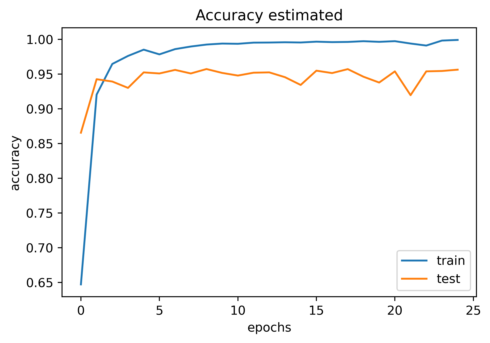

# Clasificación de noticias de El Comercio
En el periódico El Comercio, las principales categorías de las noticias son las siguientes:
- Política
- Mundo
- Economía
- Deportes
- Tecnología

El **objetivo** de este proyecto es elaborar una red neuronal recurrente capaz de clasificar estas categorías basado en el contenido de cada una de las noticias. El proceso se divide en los siguientes pasos:
1. [Extraer el contenido de cada una de la noticias](https://github.com/mauricioalvaradoo/classification_news/blob/master/1_scraping.py), mediante web scraping.
2. [Crear un corpus](https://github.com/mauricioalvaradoo/classification_news/blob/master/2_corpus.py), en el que se categoriza todas las noticias según temática.
3. [Crea una red neuronal recurrente](https://github.com/mauricioalvaradoo/classification_news/blob/master/3_classification.py), que interprete el contexto de las noticias.

Cada noticia fue almacenada en las siguientes rutas:
- [news/politica](https://github.com/mauricioalvaradoo/classification_news/blob/master/news/politica)
- [news/mundo](https://github.com/mauricioalvaradoo/classification_news/blob/master/news/mundo)
- [news/economia](https://github.com/mauricioalvaradoo/classification_news/blob/master/news/economia)
- [news/deporte](https://github.com/mauricioalvaradoo/classification_news/blob/master/news/deporte)
- [news/tech](https://github.com/mauricioalvaradoo/classification_news/blob/master/news/tech)

La fecha de inicio de la extracción fue el 04/06/2023. Hasta la fecha de 02/09/2023 se extrajeron 12'709 noticias.

## Arquitectura neuronal
Las siguientes capas componen la arquitectura neuronal recurrente:
* Embedding: **128** neuronas
* LSTM Bidireccional: **64** neuronas
* LSTM Bidireccional: **64** neuronas
* Densa: **64** neuronas
* Densa: **32** neuronas
* Densa: **5** neuronas, la capa final

## Resultados
Hasta la fecha de 02/09/2023*, son los siguientes:

      

      

      

\* Los resultados son preliminares. El ajuste en el _test sample_ fue de 97.3%. Se espera que mejore en la medida que se aumente la cantidad de noticias en los próximos días.